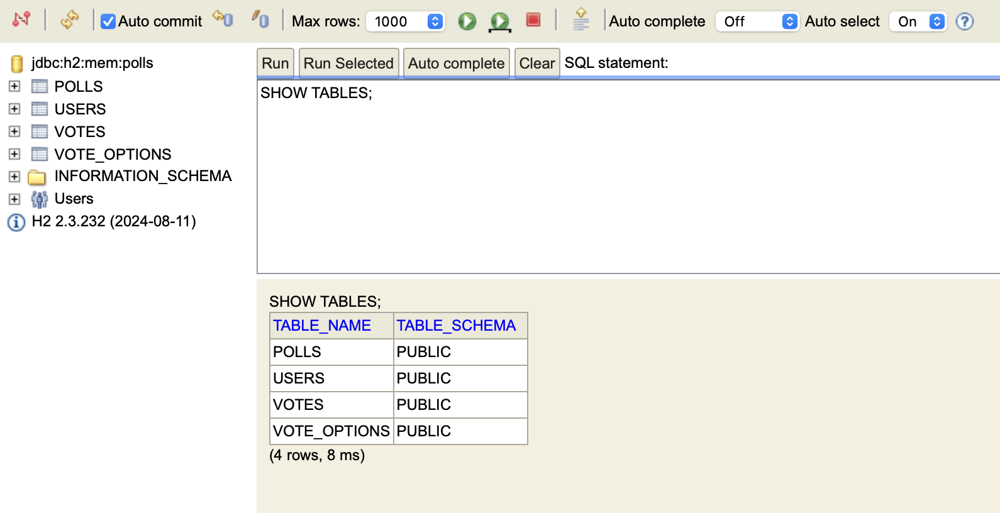
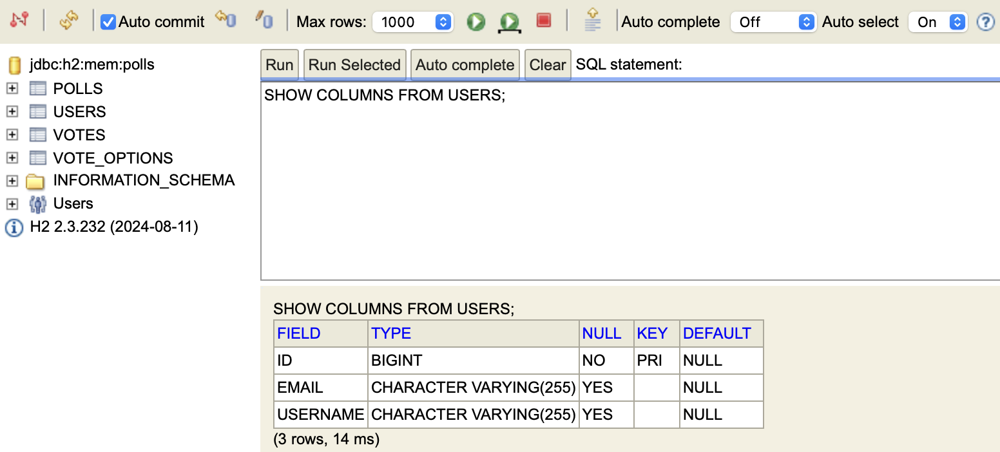
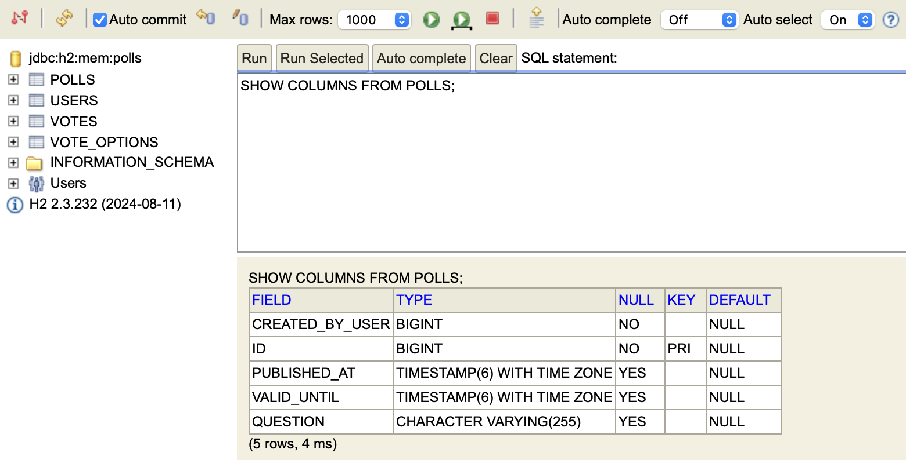
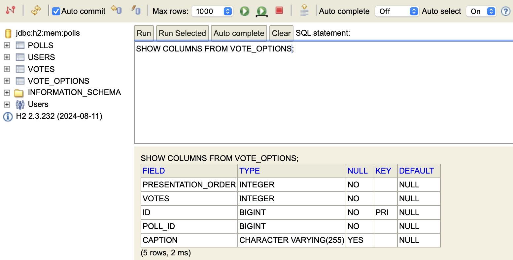
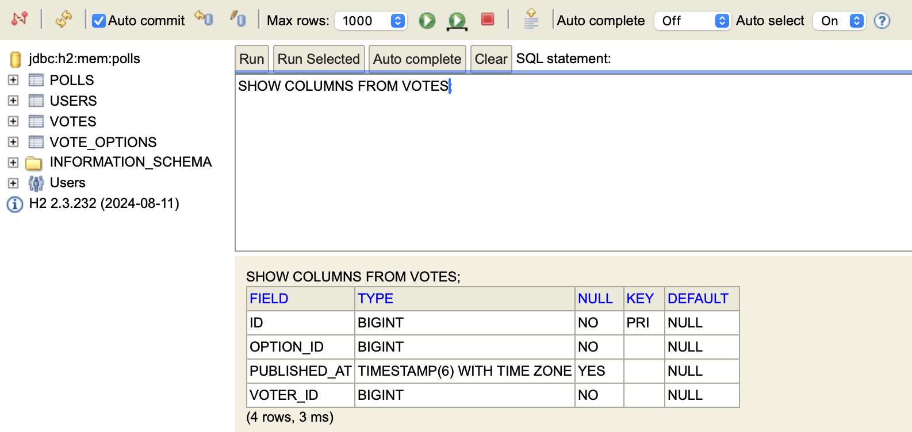

# DAT250, Experiment Assignment 4

### Implementation
The biggest change from Experiment 2 was refactoring the domain model. Originally, I had IDs for everything and manually kept track of relationships between entities. With JPA this did not work well. I had to replace these IDs with actual object references. This also meant adding annotations like `@OneToMany`, `@ManyToOne`, and `@JoinColumn` in the right places so Hibernate could understand the relationships.

Because of these changes, I also had to update the controllers, the poll manager and the test cases from expass2. The controllers could no longer just set raw IDs, but instead had to fetch the correct objects from the `PollManager` and attach them. The tests had to be updated as well, checking properties like `vote.getVoter().getId()` instead of `vote.getUserId()`.

Another challenge was JSON serialization. Since the entities now reference each other, serializing them directly sometimes caused infinite loops. To solve this I experimented with Jackson annotations like `@JsonBackReference` and `@JsonIdentityInfo`. In the end, I had to add a “shadow” field for `VoteOption` (`pollIdShadow`) so the test assertions could work without looping back endlessly.

### Testing
I used the same Spring Boot integration tests as in Experiment 2, but they had to be adapted to the new JPA model. I also added the new test file from the assignment and added Add the necessary JPA annotations to turn the exisiting Poll domain model into an entity model, which can be linked with the database.
After these changes, all the tests run successfully.

### Database inspection
To check what tables were created, I used the H2 in-memory database at http://localhost:8080/h2-console after running `./gradlew bootrun`. After connecting to it I could run queries like `SHOW TABLES;` and `SHOW COLUMNS FROM POLLS;` to confirm that Hibernate generated the right tables:
- `USERS`
- `POLLS`
- `VOTE_OPTIONS`
- `VOTES`

Below are some screenshots from the H2 console showing the table structures:

  
  
  
  

### Technical Problems
The main technical problems I faced were:
- Refactoring the model from IDs to object references, which broke a lot of the controllers and tests at first.
- Understanding how JSON serialization worked with bidirectional relationships.
- Figuring out how to avoid infinite recursion when serializing to JSON (fixed using the `pollIdShadow` workaround).

Since I had close to no prior knowledge of JPA or how Hibernate maps Java objects to relational tables, there was a lot of trial and error involved. But by the end I was able to get persistence working with the H2 database, and all the provided tests pass.

### Pending Issues
Right now everything works and the tests pass. The main thing I would like to improve later is to replace the shadow ID hack with a cleaner solution.
